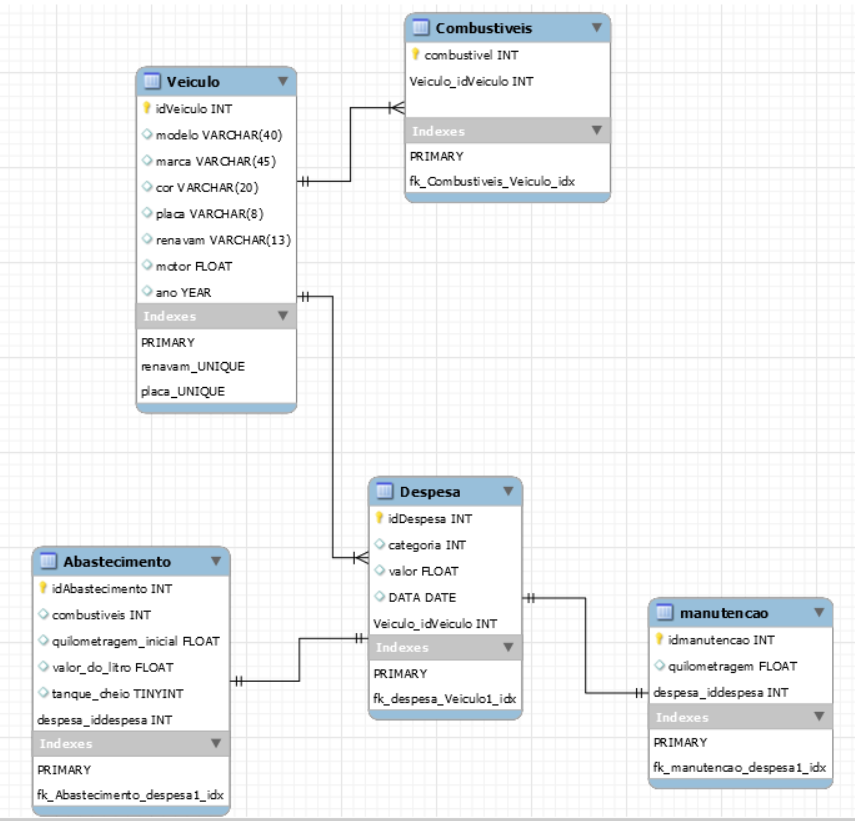

# Carrorama-Python

Gerenciador de veículos feito para o trabalho final da disciplina de Orientação a Objetos(UnB - FGA). O programa é uma transpilação do mesmo projeto escrito em JAVA.

## Links úteis
[Enunciado do Trabalho](https://docs.google.com/document/d/1x0I_2LNULSjJpVxvnhIQTRpReJNOqNZJpnxq0z2GMVo/edit)

[Diagrama UML](https://www.lucidchart.com/documents/edit/a79bdcd3-13b2-44a2-b3b7-2f096e33d066/0_0?shared=true)

# Começando

Para o programa rodar corretamente é necessário ter o MySQL e o MySQL connector/Python instalado na máquina, alem de criar o banco de dados e as tabelas, o que pode ser feito com o codigo disponibilizado em  ``` ./Database/create_tables.sql```. O MySQL connector pode ser instalado baixando o instalador no seguinte [link](https://dev.mysql.com/downloads/connector/python/).

## Configurando
Após essas tarefas terem sido executadas. tenha certeza de que o programa está de acordo com as configurações do seu banco de dados. Para isso vá no arquivo ```ControleDeVeiculos.py``` e altere nas funções ``` __init__()``` e ``` get_registros()``` o seguinte código:
    
    mysql.connector.connect(
        host="localhost",
        user="###", # insira seu usuario do SGBD aqui
        passwd="###", # insira sua senha do SGBD aqui
        db="carrorama"
        )


# Sobre

## Diagrama Entidade-Relacionamento(DER)


para uma melhor visualização abra o arquivo do DER que esta em ``` ./Database/CarroramaER.mwb```, usando o mysql workbench.

## Desenvolvimento

O programa foi sendo feito a medida em que o conhecimento para desenvolver era adquirido. A ideia primaria era apenas transpilar o codigo com o intuito de aprimorar minhas habilidades em Python. Posteriormente a ideia de criar um sistema de armazenamento durável e uma interface gráfica para o programa surgiram. 

De inicio o programa foi feito com um armazenamento que era consistente, porem volatil. A medida que a implementação de um tipo de armazenamento permanente ia avançando, foi-se percebendo o quão mais simples se tornava o programa, uma vez que é mais complexo procurar dados que estão armazenados em listas de ojetos do que realizar consultas no Banco de Dados.

## feito com:
* MySQL - SGBD utilizado
* MySQL connector/Python 8.0.18 - Conector

## A fazer:
* Criar interface Gráfica
